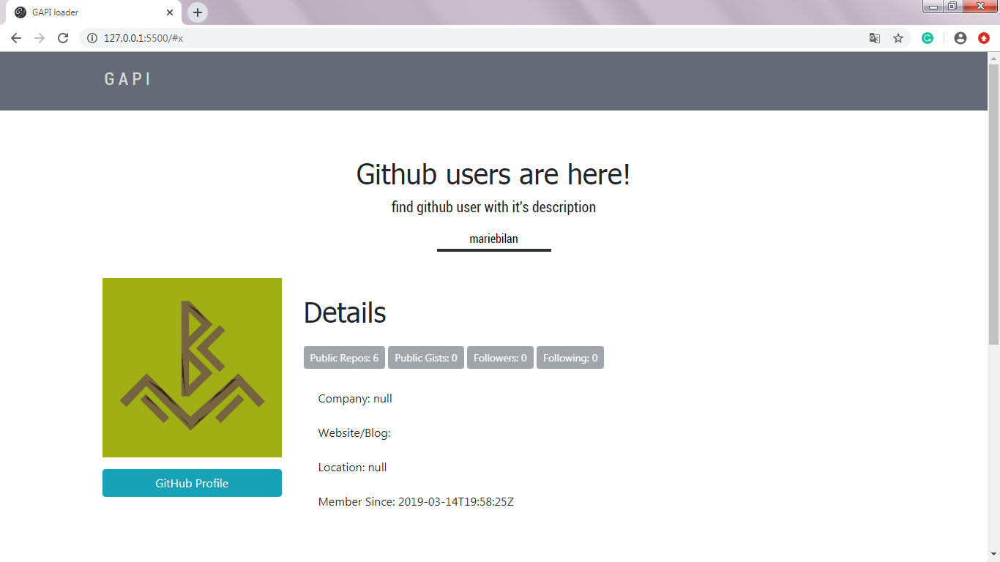
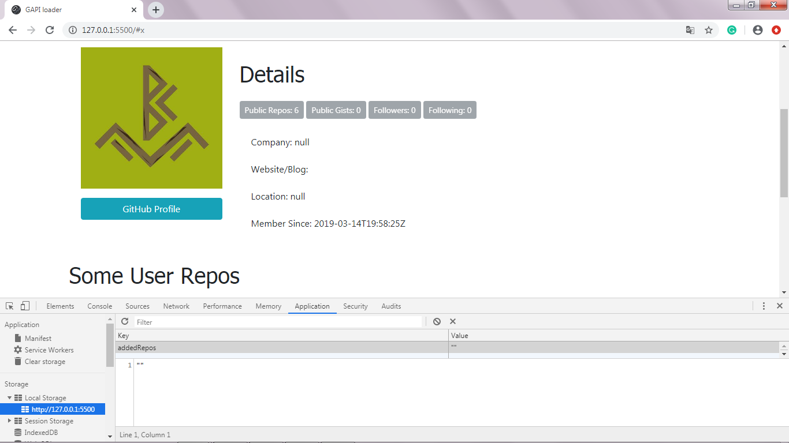
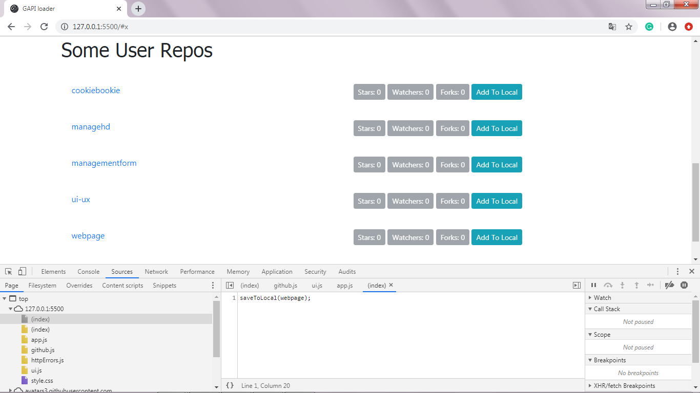

# gapi
The app to find github accounts with ability to visit github page, view some user information and repositories.

About the Project
The project was created to review Github accounts.

Project Goals
The main purpose is to display information about a Github user.

Usage
It is useful for finding specific people and their experiences on the Github platform.

Builded with
Vanilla JavaScript
jQuery
GitHub API (client_id and client_Secret: https://github.com/settings/applications/new, 
fill the form, instruction: https://auth0.com/docs/connections/social/github)
HTML
CSS
Bootstrap

